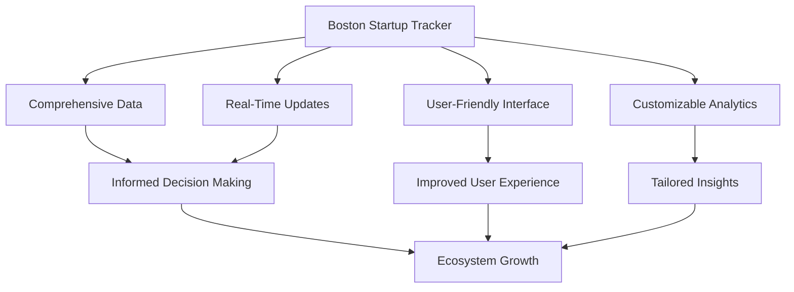
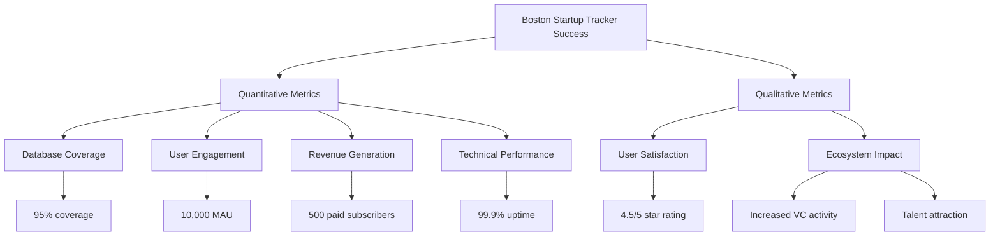
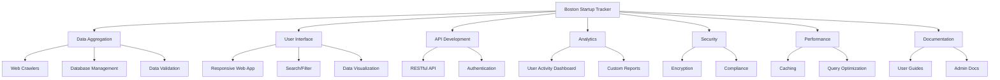
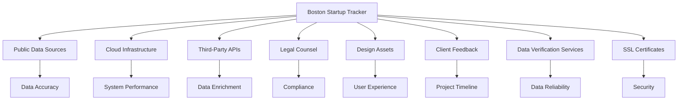
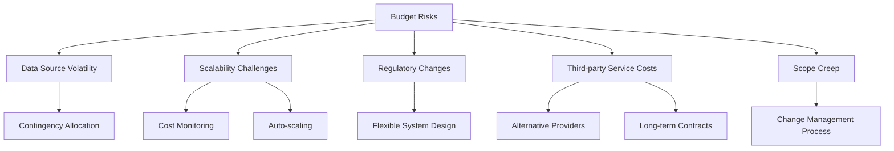
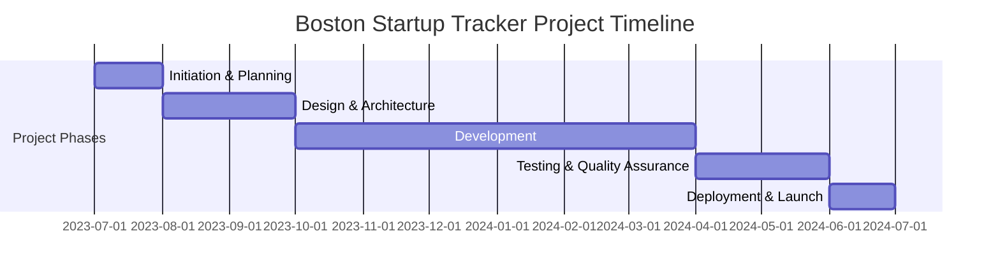
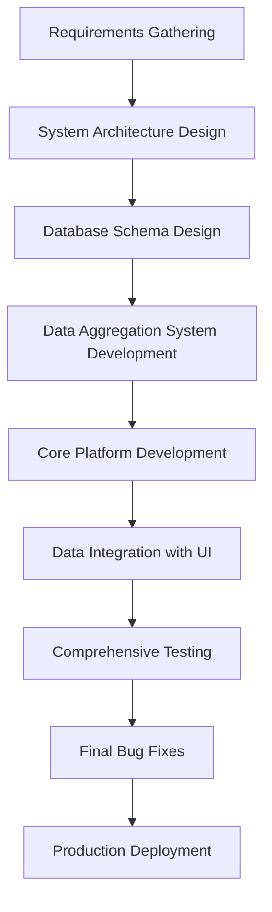
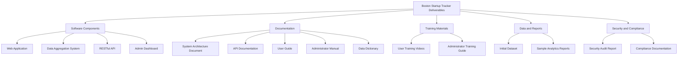
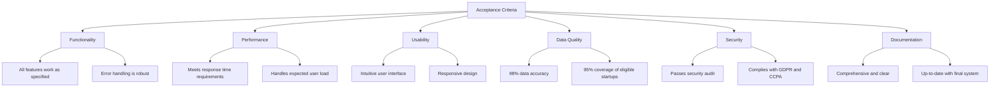

# EXECUTIVE SUMMARY

## PROJECT OVERVIEW

The Boston Startup Tracker is a comprehensive digital platform designed to provide real-time, enriched data on active venture-backed companies headquartered in Boston. This solution addresses the need for a centralized, up-to-date resource that offers insights into the vibrant Boston startup ecosystem. By aggregating and presenting crucial information from various public sources, the tracker will serve as an invaluable tool for investors, job seekers, researchers, and industry analysts.

## OBJECTIVES

1. Create a user-friendly database of Boston-based startups that have raised institutional funding within the past five years.
2. Aggregate and display key company information, including:
   - Company details (name, website, industry, sub-sector)
   - Funding information (total raised, last round, stage, investors)
   - Employee data (total count, local count, growth rate)
   - Leadership team (founders, executives)
   - Current hiring status and available roles
   - Recent news and developments
3. Implement automated data crawling and updating mechanisms to ensure information accuracy and timeliness.
4. Provide a platform for users to easily search, filter, and analyze Boston's startup landscape.

## VALUE PROPOSITION

Our agency offers a unique combination of local Boston ecosystem knowledge, technical expertise in data aggregation and analysis, and a user-centric design approach. This project will deliver:

1. **Unparalleled Data Depth**: By leveraging multiple public sources and implementing advanced data crawling techniques, we'll provide the most comprehensive and up-to-date information on Boston startups.

2. **Customized Solution**: The platform will be tailored specifically to the Boston startup ecosystem, offering relevant insights that generic startup databases cannot match.

3. **Scalable Architecture**: Our solution will be built with scalability in mind, allowing for easy expansion to include additional data points or geographic areas in the future.

4. **Intuitive User Experience**: We'll create an interface that makes it easy for users from various backgrounds to access and interpret the wealth of startup data available.

5. **Continuous Improvement**: Our team will implement feedback mechanisms and analytics to continuously refine and enhance the platform based on user needs and emerging trends in the startup ecosystem.

## PROJECT OBJECTIVES

### BUSINESS GOALS

1. Establish the Boston Startup Tracker as the premier resource for Boston's startup ecosystem information
2. Drive engagement and retention among key user groups (investors, job seekers, researchers, and industry analysts)
3. Generate revenue through premium subscriptions and data licensing
4. Foster growth and collaboration within the Boston startup community
5. Attract more venture capital and talent to the Boston area

### TECHNICAL GOALS

1. Develop a robust and scalable data aggregation system capable of crawling and updating information from multiple public sources
2. Create a high-performance database optimized for quick searches and complex queries
3. Implement a user-friendly, responsive web interface accessible across various devices
4. Ensure data accuracy and freshness through automated validation and update mechanisms
5. Develop APIs for potential integrations and data sharing with partner platforms

### SUCCESS CRITERIA

| Metric | Target | Timeframe |
|--------|--------|-----------|
| Database Coverage | 95% of eligible Boston startups | Within 6 months of launch |
| Data Accuracy | 98% accuracy rate | Ongoing |
| User Engagement | 10,000 monthly active users | Within 12 months of launch |
| Premium Subscriptions | 500 paid subscribers | Within 18 months of launch |
| Platform Uptime | 99.9% availability | Ongoing |
| API Adoption | 10 partner integrations | Within 24 months of launch |
| User Satisfaction | 4.5/5 star rating | Within 12 months of launch |

The success of the Boston Startup Tracker will be measured through a combination of quantitative metrics and qualitative assessments. These criteria will be regularly monitored and evaluated to ensure the project meets its objectives and delivers value to both users and stakeholders.

# SCOPE OF WORK

## IN-SCOPE

1. Data Aggregation and Management
   - Develop web crawlers to collect data from public sources
   - Create and maintain a database of Boston-based startups
   - Implement data validation and cleaning processes
   - Set up automated data refresh mechanisms

2. User Interface Development
   - Design and develop a responsive web application
   - Create search and filter functionality
   - Implement data visualization features (charts, graphs)
   - Develop user account management system

3. API Development
   - Create RESTful API for data access
   - Implement authentication and rate limiting
   - Develop documentation for API usage

4. Analytics and Reporting
   - Implement basic analytics dashboard for user activity
   - Create customizable reports for premium users

5. Security and Compliance
   - Implement data encryption and secure storage
   - Ensure GDPR and CCPA compliance
   - Conduct security audits and penetration testing

6. Performance Optimization
   - Implement caching mechanisms
   - Optimize database queries for fast retrieval
   - Conduct load testing and performance tuning

7. Documentation and Training
   - Create user guides and FAQs
   - Develop admin documentation for platform management

## OUT-OF-SCOPE

1. Mobile Applications
   - Native iOS or Android apps will not be developed in this phase

2. Advanced Machine Learning
   - Predictive analytics or AI-driven insights are not included

3. Direct Integrations
   - Direct integrations with third-party platforms (e.g., CRM systems) are not included

4. Content Creation
   - Writing original content or analysis about startups is not part of this scope

5. Financial Transactions
   - Payment processing or financial transactions beyond subscription management are excluded

6. Legal Services
   - Providing legal advice or due diligence services related to startups is out of scope

7. Event Management
   - Organizing or managing startup events through the platform is not included

## ASSUMPTIONS

1. Data Availability: Public sources will continue to provide accessible and reliable startup data.

2. Regulatory Environment: Current data privacy and usage regulations will remain stable during development.

3. Technology Stack: Chosen technologies will remain supported and compatible throughout the project lifecycle.

4. Client Resources: The client will provide timely feedback and approvals at key project milestones.

5. User Adoption: There is sufficient interest in the Boston startup ecosystem to drive user adoption.

6. Scalability: The initial architecture will support future expansion to other geographic areas if needed.

7. Third-Party Services: Essential third-party services (e.g., cloud hosting, data verification) will remain available and stable.

## DEPENDENCIES

| Dependency | Description | Impact |
|------------|-------------|--------|
| Public Data Sources | Availability and consistency of startup data from public sources | Critical for data accuracy and completeness |
| Cloud Infrastructure | Reliability and performance of chosen cloud provider | Affects system uptime and scalability |
| Third-Party APIs | Stability and rate limits of external APIs used for data enrichment | Influences data freshness and depth |
| Legal Counsel | Timely review of data usage and privacy policies | Ensures compliance and mitigates legal risks |
| Design Assets | Delivery of UI/UX designs and brand guidelines | Impacts development timeline and user experience |
| Client Feedback | Timely client input on features and functionality | Affects project timeline and final deliverables |
| Data Verification Services | Availability of services to verify startup information | Enhances data accuracy and reliability |
| SSL Certificates | Procurement and renewal of security certificates | Essential for secure user connections |

## BUDGET AND COST ESTIMATES

### COST BREAKDOWN

The following table provides a detailed breakdown of the project costs for the Boston Startup Tracker:

| Category | Item | Cost (USD) |
|----------|------|------------|
| Labor | Backend Development (1000 hours @ $150/hr) | 150,000 |
| Labor | Frontend Development (800 hours @ $130/hr) | 104,000 |
| Labor | Data Engineering (600 hours @ $160/hr) | 96,000 |
| Labor | UI/UX Design (300 hours @ $120/hr) | 36,000 |
| Labor | Project Management (400 hours @ $140/hr) | 56,000 |
| Labor | Quality Assurance (400 hours @ $110/hr) | 44,000 |
| Infrastructure | Cloud Hosting (Annual) | 30,000 |
| Infrastructure | Database Services (Annual) | 15,000 |
| Software | Development Tools and Licenses | 10,000 |
| Services | Third-party APIs and Data Services (Annual) | 25,000 |
| Services | Security Audit and Penetration Testing | 20,000 |
| Legal | Legal Review and Compliance Consultation | 15,000 |
| Contingency | 10% of total budget | 60,100 |
| **Total** |  | **661,100** |

### PAYMENT SCHEDULE

The payment schedule is structured around key project milestones:

| Milestone | Percentage | Amount (USD) | Deliverables |
|-----------|------------|--------------|--------------|
| Project Kickoff | 20% | 132,220 | Project plan, initial designs, architecture document |
| Data Aggregation System | 25% | 165,275 | Functional data crawlers, database schema, initial dataset |
| Core Platform Development | 25% | 165,275 | Basic web interface, search functionality, API endpoints |
| Feature Complete | 20% | 132,220 | Full feature set, including analytics, user management |
| Project Launch | 10% | 66,110 | Deployed platform, documentation, training materials |

### BUDGET CONSIDERATIONS

Several factors could impact the budget and require careful management:

1. **Data Source Volatility**: Changes in public data sources may require additional development work.
   - Mitigation: Allocate part of the contingency budget for potential data source adaptations.

2. **Scalability Challenges**: Unexpected growth in data volume could increase infrastructure costs.
   - Mitigation: Implement cost monitoring and auto-scaling solutions to optimize resource usage.

3. **Regulatory Changes**: New data privacy laws could necessitate compliance-related modifications.
   - Mitigation: Stay informed about upcoming regulations and include flexibility in the system design.

4. **Third-party Service Costs**: Prices for essential APIs or services may increase.
   - Mitigation: Explore alternative providers and consider long-term contracts to lock in rates.

5. **Scope Creep**: Client requests for additional features could extend the project timeline.
   - Mitigation: Implement a strict change management process with clear cost implications for new features.

To manage these considerations effectively, we will:
- Conduct monthly budget reviews
- Maintain open communication with the client about potential impacts
- Prioritize features to ensure core functionality is delivered within budget
- Leverage agile development practices to adapt to changes quickly and efficiently

## TIMELINE AND MILESTONES

### PROJECT TIMELINE

The Boston Startup Tracker project will be executed over a 12-month period, divided into five main phases:

### KEY MILESTONES

| Milestone | Description | Target Date |
|-----------|-------------|-------------|
| Project Kickoff | Initiation of the project, team assembly, and initial planning | 2023-07-01 |
| Requirements Finalization | Completion of detailed requirements gathering and documentation | 2023-07-31 |
| Design Approval | Finalization and approval of system architecture and UI/UX designs | 2023-09-30 |
| Data Aggregation System Complete | Functional web crawlers and initial database populated | 2023-12-31 |
| Core Platform Development | Basic web interface, search functionality, and API endpoints operational | 2024-02-29 |
| Feature Complete | All planned features implemented and ready for testing | 2024-03-31 |
| Testing Complete | Comprehensive testing finished, including security and performance audits | 2024-05-31 |
| Platform Launch | Public release of the Boston Startup Tracker | 2024-06-30 |

### CRITICAL PATH

The following tasks represent the critical path for the Boston Startup Tracker project:

1. Requirements gathering and analysis
2. System architecture design
3. Database schema design and implementation
4. Development of data aggregation system (web crawlers)
5. Core platform development (backend and frontend)
6. Integration of data aggregation with user interface
7. Comprehensive testing (functional, performance, and security)
8. Final bug fixes and optimizations
9. Deployment to production environment

To ensure the project remains on schedule, particular attention will be paid to:

- Timely completion of the system architecture design, as it influences all subsequent development tasks
- Early development and testing of the data aggregation system, as it's crucial for populating the platform with accurate startup data
- Continuous integration and testing throughout the development phase to identify and address issues early
- Efficient management of any dependencies on third-party services or APIs
- Regular progress reviews and adjustments to the timeline as needed, with prompt communication to all stakeholders

By focusing on these critical path elements and maintaining flexibility in our approach, we aim to deliver the Boston Startup Tracker on time and to the highest quality standards.

# DELIVERABLES

## LIST OF DELIVERABLES

The Boston Startup Tracker project will produce the following tangible outputs:

1. Software Components
   - Web Application
   - Data Aggregation System
   - RESTful API
   - Admin Dashboard

2. Documentation
   - System Architecture Document
   - API Documentation
   - User Guide
   - Administrator Manual
   - Data Dictionary

3. Training Materials
   - User Training Videos
   - Administrator Training Guide

4. Data and Reports
   - Initial Dataset of Boston Startups
   - Sample Analytics Reports

5. Security and Compliance
   - Security Audit Report
   - GDPR and CCPA Compliance Documentation

## DELIVERY SCHEDULE

| Deliverable | Expected Completion Date |
|-------------|--------------------------|
| System Architecture Document | 2023-09-15 |
| Data Aggregation System | 2023-12-31 |
| Initial Dataset of Boston Startups | 2024-01-15 |
| RESTful API | 2024-02-15 |
| Web Application (Beta Version) | 2024-03-15 |
| API Documentation | 2024-03-31 |
| Admin Dashboard | 2024-04-15 |
| User Guide | 2024-04-30 |
| Administrator Manual | 2024-05-15 |
| Security Audit Report | 2024-05-31 |
| GDPR and CCPA Compliance Documentation | 2024-06-15 |
| User Training Videos | 2024-06-20 |
| Administrator Training Guide | 2024-06-25 |
| Web Application (Final Version) | 2024-06-30 |

## ACCEPTANCE CRITERIA

To ensure that each deliverable meets the client's requirements, the following acceptance criteria will be used:

1. Web Application
   - Responsive design works on desktop and mobile devices
   - All planned features are functional and bug-free
   - Search and filter functionality performs as specified
   - Data visualizations are accurate and render correctly
   - User authentication and account management work seamlessly

2. Data Aggregation System
   - Successfully crawls and aggregates data from specified public sources
   - Updates data at the agreed-upon frequency
   - Maintains data accuracy of at least 98%
   - Handles exceptions and errors gracefully

3. RESTful API
   - Adheres to RESTful principles
   - All endpoints are functional and return correct data
   - Authentication and rate limiting are properly implemented
   - Performs within specified response time limits

4. Admin Dashboard
   - Provides all specified management functions
   - Displays accurate system analytics and user statistics
   - Allows for easy management of user accounts and permissions

5. Documentation
   - Comprehensive and accurate coverage of all system components
   - Clear, well-organized, and free of errors
   - Includes all necessary diagrams, code examples, and explanations

6. Training Materials
   - Cover all essential features and functions of the platform
   - Clear and easy to understand for the target audience
   - Include practical examples and exercises

7. Initial Dataset
   - Covers at least 95% of eligible Boston startups
   - All required data points are populated for each entry
   - Data is verified for accuracy and completeness

8. Security and Compliance
   - Security audit report shows no critical vulnerabilities
   - Compliance documentation meets all requirements of GDPR and CCPA

Each deliverable will be subject to a formal review process involving key stakeholders. Acceptance will be granted only when all criteria are met and any identified issues are resolved to the client's satisfaction.