# INTRODUCTION

## PURPOSE

The purpose of this Software Requirements Specification (SRS) document is to provide a comprehensive and detailed description of the Boston Startup Tracker project. This document serves as the primary reference for all stakeholders involved in the development, implementation, and maintenance of the system. It aims to:

1. Clearly define the functional and non-functional requirements of the Boston Startup Tracker.
2. Establish a shared understanding of the project scope and objectives among all stakeholders.
3. Serve as a basis for project planning, cost estimation, and resource allocation.
4. Provide a benchmark for validation and verification during the development process.

The intended audience for this SRS includes:

- Project managers and team leads
- Software developers and engineers
- Quality assurance and testing teams
- UX/UI designers
- Database administrators
- Client representatives and decision-makers
- Potential investors or partners interested in the project

This document will evolve throughout the development lifecycle, with updates and revisions made as necessary to reflect changes in requirements or project scope.

## SCOPE

The Boston Startup Tracker is a comprehensive web-based platform designed to aggregate, analyze, and present data on venture-backed companies headquartered in Boston. The system aims to provide a centralized, up-to-date resource for investors, job seekers, researchers, and industry analysts interested in the Boston startup ecosystem.

### Goals

1. Create a user-friendly, searchable database of Boston-based startups that have raised institutional funding within the past five years.
2. Provide real-time, enriched data on these startups by aggregating information from various public sources.
3. Offer valuable insights into the Boston startup ecosystem through data visualization and analytics tools.
4. Facilitate informed decision-making for investors, job seekers, and other stakeholders in the startup community.

### Benefits

1. Centralized Information: Consolidates data from multiple sources into a single, easily accessible platform.
2. Time Efficiency: Reduces the time and effort required to research Boston startups.
3. Data Accuracy: Implements automated data crawling and validation processes to ensure up-to-date and reliable information.
4. Ecosystem Insights: Provides a comprehensive view of the Boston startup landscape, fostering growth and collaboration.
5. Customizable Experience: Allows users to tailor their search and analysis based on specific criteria and interests.

### Core Functionalities

1. Data Aggregation and Management
   - Web crawlers to collect data from public sources
   - Database to store and manage startup information
   - Automated data refresh and validation mechanisms

2. User Interface
   - Responsive web application accessible on desktop and mobile devices
   - Advanced search and filter functionality
   - Interactive data visualizations (charts, graphs, maps)

3. Startup Profiles
   - Detailed company information (name, website, industry, sub-sector)
   - Funding details (total raised, last round, stage, investors)
   - Employee data (total count, local count, growth rate)
   - Leadership team information (founders, executives)
   - Current hiring status and available roles
   - Recent news and developments

4. Analytics and Reporting
   - Customizable dashboards for data analysis
   - Trend identification and visualization
   - Exportable reports for premium users

5. API Access
   - RESTful API for data retrieval and integration with third-party applications
   - Authentication and rate limiting for secure access

6. User Account Management
   - User registration and authentication
   - Personalized saved searches and alerts
   - Subscription management for premium features

7. Admin Dashboard
   - System monitoring and performance analytics
   - User management and access control
   - Data quality monitoring and manual override capabilities

The Boston Startup Tracker will be developed using modern web technologies, including a robust backend framework for data processing and API development, and a responsive frontend framework for the user interface. The system will be designed with scalability and performance in mind, utilizing cloud infrastructure to ensure high availability and efficient data processing.

By focusing on these core functionalities and goals, the Boston Startup Tracker aims to become the definitive resource for information on the Boston startup ecosystem, driving value for all stakeholders in the community.

# PRODUCT DESCRIPTION

## PRODUCT PERSPECTIVE

The Boston Startup Tracker is a standalone web-based platform designed to serve as a comprehensive resource for information on venture-backed companies in the Boston area. While it operates independently, it interacts with various external systems and data sources to provide a holistic view of the startup ecosystem:

1. Public Data Sources: The system integrates with multiple public databases, websites, and APIs to gather and verify startup information.

2. Cloud Infrastructure: Hosted on a scalable cloud platform to ensure high availability and performance.

3. User Devices: Accessible through web browsers on desktop computers, tablets, and mobile devices.

4. Third-party Analytics Tools: Integrates with external analytics services for user behavior tracking and system performance monitoring.

5. Email Systems: Connects with email services for user notifications and alerts.

6. Payment Gateways: Interfaces with secure payment processing systems for premium subscriptions.

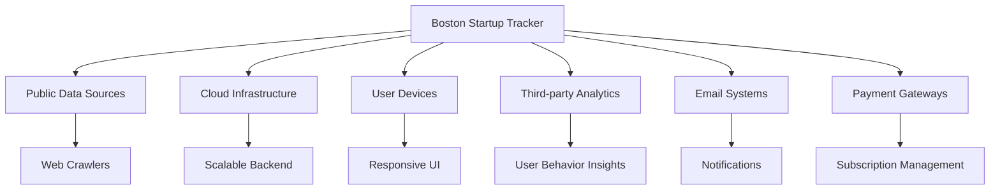

## PRODUCT FUNCTIONS

The Boston Startup Tracker will perform the following main functions:

1. Data Aggregation and Management
   - Crawl and collect data from various public sources
   - Store and manage startup information in a structured database
   - Validate and update data regularly to ensure accuracy

2. Search and Discovery
   - Provide advanced search functionality with multiple filters
   - Offer customizable startup lists based on user preferences
   - Generate recommendations based on user behavior and interests

3. Startup Profiling
   - Display comprehensive profiles for each startup
   - Visualize key metrics and trends for individual companies
   - Track changes and updates in startup information over time

4. Analytics and Insights
   - Generate ecosystem-wide analytics and trend reports
   - Offer customizable dashboards for data analysis
   - Provide comparative analysis tools for startups and sectors

5. User Management
   - Handle user registration, authentication, and profile management
   - Manage subscription levels and access rights
   - Implement personalized features such as saved searches and alerts

6. API Access
   - Provide a RESTful API for programmatic data access
   - Implement authentication and rate limiting for API users
   - Offer documentation and support for API integration

7. Administration and Monitoring
   - Provide an admin dashboard for system management
   - Monitor system performance and data quality
   - Generate usage reports and analytics for platform optimization

## USER CHARACTERISTICS

The Boston Startup Tracker is designed to cater to a diverse group of users with varying levels of expertise and interests in the startup ecosystem. The primary user groups include:

1. Investors
   - Expertise: High level of financial and business knowledge
   - Needs: Detailed startup information, funding history, growth metrics
   - Persona: Sarah, 35, Venture Capitalist at a Boston-based firm

2. Entrepreneurs
   - Expertise: Varied business and technical backgrounds
   - Needs: Market research, competitor analysis, potential investor information
   - Persona: Mike, 28, Tech Entrepreneur working on his second startup

3. Job Seekers
   - Expertise: Range from entry-level to experienced professionals
   - Needs: Company information, hiring status, growth potential
   - Persona: Emily, 24, Recent graduate looking for opportunities in tech startups

4. Researchers and Analysts
   - Expertise: High level of analytical skills and domain knowledge
   - Needs: Comprehensive data sets, trend analysis, ecosystem insights
   - Persona: Dr. Chen, 42, Economics Professor studying startup ecosystems

5. Industry Professionals
   - Expertise: Varied backgrounds in business, technology, and related fields
   - Needs: General ecosystem insights, networking opportunities, trend tracking
   - Persona: Alex, 31, Business Development Manager at a tech company

6. Media and Journalists
   - Expertise: Strong communication skills, varying levels of tech/business knowledge
   - Needs: Latest startup news, funding announcements, industry trends
   - Persona: Jessica, 39, Technology Reporter for a major Boston newspaper

## CONSTRAINTS

The development and operation of the Boston Startup Tracker are subject to the following constraints:

1. Data Privacy and Legal Compliance
   - Must adhere to GDPR and CCPA regulations for data collection and user privacy
   - Limited to using publicly available information to avoid legal issues

2. Technical Constraints
   - Must be compatible with major web browsers (Chrome, Firefox, Safari, Edge)
   - Mobile responsiveness required for all features
   - API rate limits imposed by third-party data sources

3. Performance Requirements
   - Page load times must not exceed 3 seconds under normal conditions
   - System must handle up to 10,000 concurrent users without performance degradation

4. Security Constraints
   - All user data must be encrypted at rest and in transit
   - Regular security audits and penetration testing required

5. Budgetary Constraints
   - Development and first-year operation costs must not exceed $700,000
   - Ongoing operational costs to be covered by subscription revenue within 18 months of launch

6. Time Constraints
   - Initial version of the platform must be launched within 12 months
   - Quarterly feature updates required post-launch

7. Data Accuracy
   - Maintain a minimum of 98% data accuracy for all startup information
   - Update frequency for startup data must be at least weekly

8. Scalability
   - Architecture must support expansion to other geographic regions without major refactoring

## ASSUMPTIONS AND DEPENDENCIES

The successful development and operation of the Boston Startup Tracker are based on the following assumptions and dependencies:

### Assumptions

1. The Boston startup ecosystem will continue to grow and attract interest from various stakeholders.
2. Public data sources will remain accessible and maintain their current level of information availability.
3. Users will be willing to pay for premium features and access to comprehensive startup data.
4. The regulatory environment regarding data privacy and usage will remain relatively stable.
5. Cloud infrastructure costs will remain within projected estimates.
6. The project team will have consistent access to necessary development resources and expertise.

### Dependencies

1. Availability and reliability of third-party data sources and APIs
   - Impact: Critical for maintaining up-to-date and accurate startup information

2. Cloud service provider's infrastructure and uptime
   - Impact: Essential for system availability and performance

3. Timely delivery of UI/UX designs from the design team
   - Impact: Affects development timeline and user experience quality

4. Acquisition of necessary licenses for development tools and third-party libraries
   - Impact: Could delay development if not obtained in time

5. Compliance certification from legal team for data usage and privacy policies
   - Impact: Critical for lawful operation and user trust

6. Availability of beta testers from target user groups
   - Impact: Important for user feedback and product refinement

7. Stability of chosen technology stack and frameworks
   - Impact: Affects long-term maintainability and performance of the system

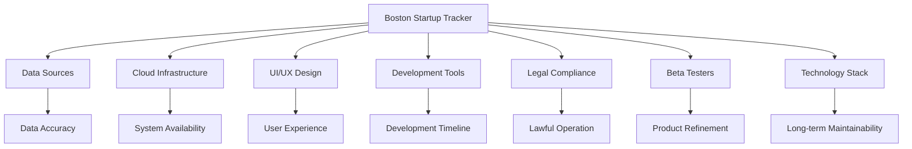

By carefully managing these assumptions and dependencies, the project team can mitigate risks and ensure the successful delivery and operation of the Boston Startup Tracker.

# PROCESS FLOWCHART

The following process flowcharts illustrate the key workflows within the Boston Startup Tracker system:

## Data Aggregation Process

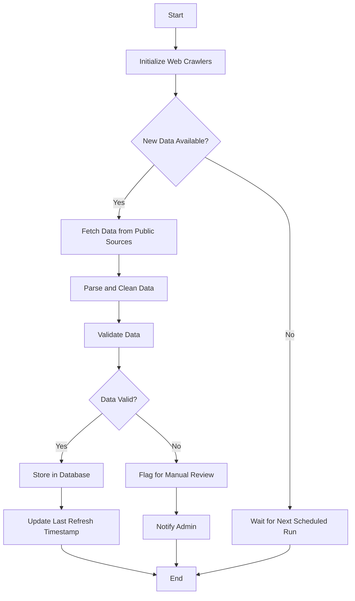

## User Search Process

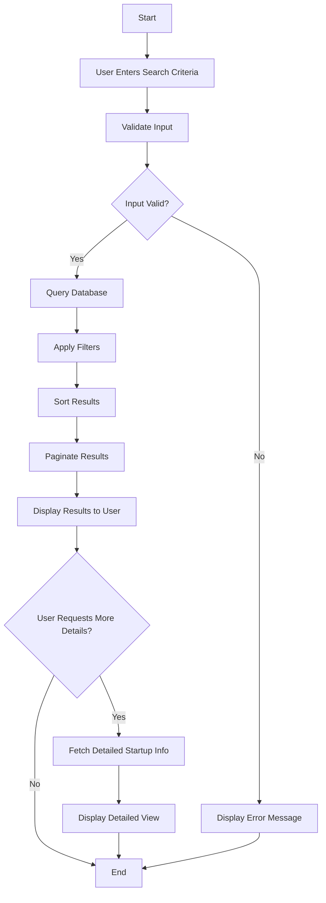

## API Request Handling

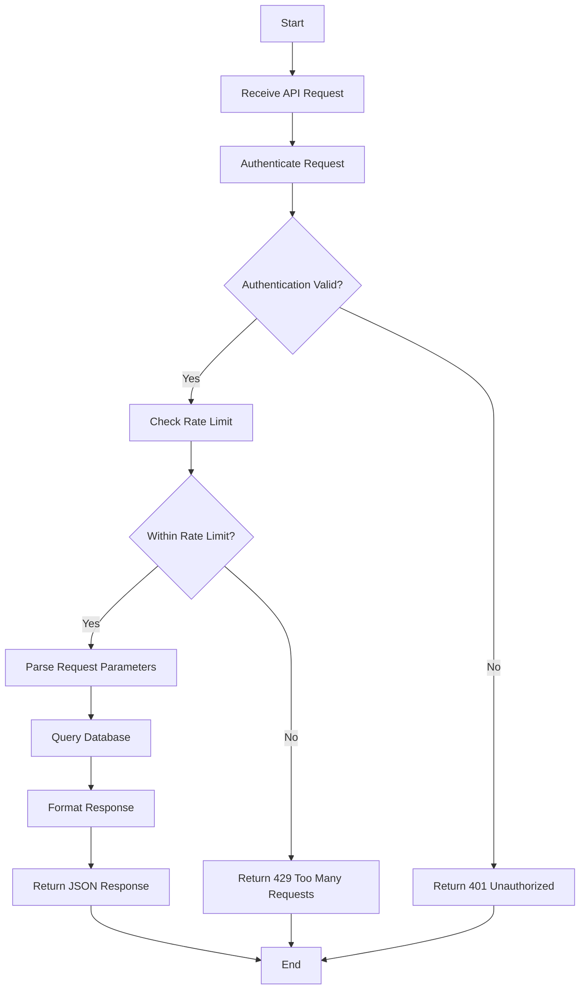

## User Registration Process

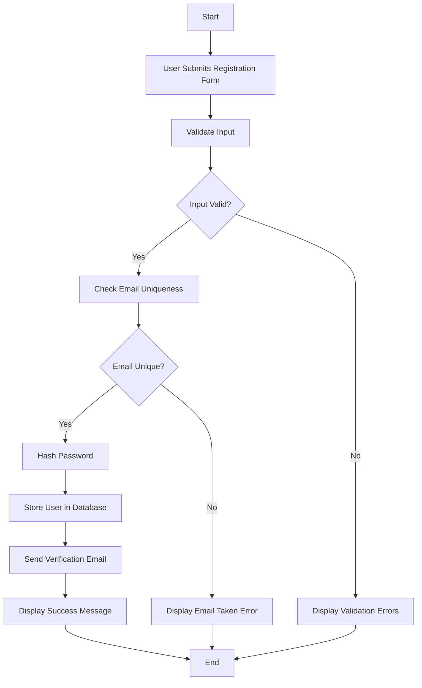

These flowcharts provide a high-level overview of the key processes within the Boston Startup Tracker system. They illustrate the logical flow of data and user interactions, ensuring consistency with the previously established technical requirements and system architecture. The processes are designed to support the core functionalities of data aggregation, user interaction, API access, and user management, aligning with the overall goals of the project.

Based on the previously established requirements and system architecture, here's a breakdown of the Boston Startup Tracker features with their respective functional requirements:

1. Data Aggregation System

ID: F001
DESCRIPTION: Automated system for collecting, validating, and storing startup data from various public sources.
PRIORITY: High

| Requirement ID | Requirement Description | Priority |
|----------------|-------------------------|----------|
| F001-1 | Implement web crawlers for data collection from specified public sources | High |
| F001-2 | Develop data cleaning and validation algorithms | High |
| F001-3 | Create a database schema optimized for startup data storage | High |
| F001-4 | Implement automated data refresh mechanism | Medium |
| F001-5 | Develop error handling and logging system for data aggregation process | Medium |

2. Startup Search and Discovery

ID: F002
DESCRIPTION: Advanced search functionality allowing users to find and filter startup information based on various criteria.
PRIORITY: High

| Requirement ID | Requirement Description | Priority |
|----------------|-------------------------|----------|
| F002-1 | Implement full-text search across all startup fields | High |
| F002-2 | Develop filtering system based on industry, funding stage, employee count, etc. | High |
| F002-3 | Create sorting options for search results | Medium |
| F002-4 | Implement pagination for search results | Medium |
| F002-5 | Develop autocomplete functionality for search input | Low |

3. Startup Profile Pages

ID: F003
DESCRIPTION: Detailed profile pages for each startup, displaying comprehensive information and key metrics.
PRIORITY: High

| Requirement ID | Requirement Description | Priority |
|----------------|-------------------------|----------|
| F003-1 | Design and implement startup profile layout | High |
| F003-2 | Display all relevant startup information (name, description, funding, etc.) | High |
| F003-3 | Implement data visualizations for key metrics | Medium |
| F003-4 | Create a section for recent news and updates | Medium |
| F003-5 | Develop a feature to track and display changes in startup information over time | Low |

4. User Account Management

ID: F004
DESCRIPTION: System for user registration, authentication, and profile management.
PRIORITY: Medium

| Requirement ID | Requirement Description | Priority |
|----------------|-------------------------|----------|
| F004-1 | Implement user registration and login functionality | High |
| F004-2 | Develop password reset and email verification features | High |
| F004-3 | Create user profile management interface | Medium |
| F004-4 | Implement role-based access control | Medium |
| F004-5 | Develop OAuth integration for social login options | Low |

5. Analytics Dashboard

ID: F005
DESCRIPTION: Interactive dashboard providing insights and visualizations of the Boston startup ecosystem.
PRIORITY: Medium

| Requirement ID | Requirement Description | Priority |
|----------------|-------------------------|----------|
| F005-1 | Design and implement analytics dashboard layout | High |
| F005-2 | Develop charts and graphs for key ecosystem metrics | High |
| F005-3 | Implement filtering and customization options for dashboard | Medium |
| F005-4 | Create export functionality for dashboard data and visualizations | Medium |
| F005-5 | Implement real-time updates for dashboard data | Low |

6. API Access

ID: F006
DESCRIPTION: RESTful API allowing programmatic access to startup data and platform features.
PRIORITY: Medium

| Requirement ID | Requirement Description | Priority |
|----------------|-------------------------|----------|
| F006-1 | Design and implement RESTful API endpoints | High |
| F006-2 | Develop API authentication and rate limiting system | High |
| F006-3 | Create comprehensive API documentation | Medium |
| F006-4 | Implement versioning system for API | Medium |
| F006-5 | Develop SDK for common programming languages | Low |

7. Admin Dashboard

ID: F007
DESCRIPTION: Administrative interface for managing platform data, users, and system settings.
PRIORITY: Medium

| Requirement ID | Requirement Description | Priority |
|----------------|-------------------------|----------|
| F007-1 | Design and implement admin dashboard layout | High |
| F007-2 | Develop user management features (view, edit, delete users) | High |
| F007-3 | Create data management tools (edit, verify, delete startup data) | High |
| F007-4 | Implement system monitoring and log viewing features | Medium |
| F007-5 | Develop configuration management for platform settings | Medium |

8. Notification System

ID: F008
DESCRIPTION: System for sending alerts and notifications to users based on their preferences and platform activities.
PRIORITY: Low

| Requirement ID | Requirement Description | Priority |
|----------------|-------------------------|----------|
| F008-1 | Implement email notification system | Medium |
| F008-2 | Develop in-app notification center | Medium |
| F008-3 | Create user preference settings for notifications | Medium |
| F008-4 | Implement notification triggers for startup updates and system events | Low |
| F008-5 | Develop push notification capability for mobile devices | Low |

These features and their functional requirements are designed to be consistent with the previously established technical requirements and system architecture. They cover the core functionalities of the Boston Startup Tracker while allowing for future expansion and enhancement of the platform.

# NON-FUNCTIONAL REQUIREMENTS

## PERFORMANCE

1. Response Time
   - Web application pages must load within 2 seconds under normal conditions.
   - API responses must be delivered within 500 milliseconds for 95% of requests.
   - Search queries must return results within 1 second for up to 1000 concurrent users.

2. Throughput
   - The system must support at least 10,000 concurrent users without performance degradation.
   - Data aggregation system must process updates for at least 1000 startups per hour.

3. Resource Usage
   - Database queries must not consume more than 70% of available CPU resources during peak loads.
   - Memory usage should not exceed 80% of available RAM under normal operating conditions.

## SAFETY

1. Data Backup
   - Automated daily backups of all system data must be performed and stored in a secure, off-site location.
   - The system must be able to recover from data loss within 4 hours of a failure event.

2. Fault Tolerance
   - The system must continue to function with degraded performance in case of partial component failures.
   - Automatic failover mechanisms must be in place for critical system components.

3. Error Handling
   - All system errors must be logged with appropriate detail for troubleshooting.
   - User-facing error messages must be clear and non-technical.

## SECURITY

1. Authentication
   - Multi-factor authentication must be available for all user accounts.
   - Passwords must meet industry-standard complexity requirements (minimum 12 characters, including uppercase, lowercase, numbers, and special characters).

2. Authorization
   - Role-based access control (RBAC) must be implemented to restrict access to sensitive data and administrative functions.
   - API access must be controlled through token-based authentication with expiration.

3. Data Encryption
   - All data must be encrypted at rest using AES-256 encryption.
   - All data in transit must be encrypted using TLS 1.3 or higher.

4. Privacy
   - Personal user data must be anonymized or pseudonymized where possible.
   - Users must have the ability to request deletion of their personal data in compliance with GDPR and CCPA.

## QUALITY

1. Availability
   - The system must maintain 99.9% uptime, excluding scheduled maintenance windows.
   - Scheduled maintenance must not exceed 4 hours per month and must be performed during off-peak hours.

2. Maintainability
   - The codebase must adhere to agreed-upon coding standards and best practices.
   - Comprehensive documentation must be maintained for all system components and APIs.
   - The system must use containerization (e.g., Docker) to ensure consistency across development, testing, and production environments.

3. Usability
   - The user interface must be responsive and compatible with the latest versions of Chrome, Firefox, Safari, and Edge browsers.
   - The system must achieve a System Usability Scale (SUS) score of at least 80.
   - All user interfaces must be accessible and comply with WCAG 2.1 Level AA standards.

4. Scalability
   - The system architecture must support horizontal scaling to handle increased load.
   - Database design must support partitioning and sharding for future growth.

5. Reliability
   - The mean time between failures (MTBF) must be at least 720 hours (30 days).
   - The mean time to recover (MTTR) must not exceed 2 hours for critical system components.

## COMPLIANCE

1. Legal
   - The system must comply with all applicable data protection laws, including GDPR and CCPA.
   - Terms of service and privacy policy must be clearly displayed and require user acceptance.

2. Regulatory
   - The system must adhere to financial regulations if handling any financial data or transactions.
   - Regular security audits must be conducted to ensure compliance with industry standards.

3. Standards
   - The web application must conform to W3C standards for HTML, CSS, and JavaScript.
   - API design must follow RESTful principles and OpenAPI Specification 3.0.

4. Accessibility
   - The system must comply with Section 508 of the Rehabilitation Act for accessibility.

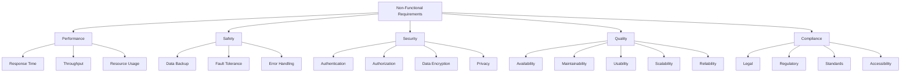

These non-functional requirements are designed to ensure that the Boston Startup Tracker is performant, secure, reliable, and compliant with relevant standards and regulations. They align with the previously established technical requirements and system architecture, including the use of cloud infrastructure, modern web technologies, and best practices in software development and data management.

# DATA REQUIREMENTS

## DATA MODELS

The Boston Startup Tracker will utilize a relational database management system (RDBMS) to store and manage data. The following entity-relationship diagram illustrates the core data model:

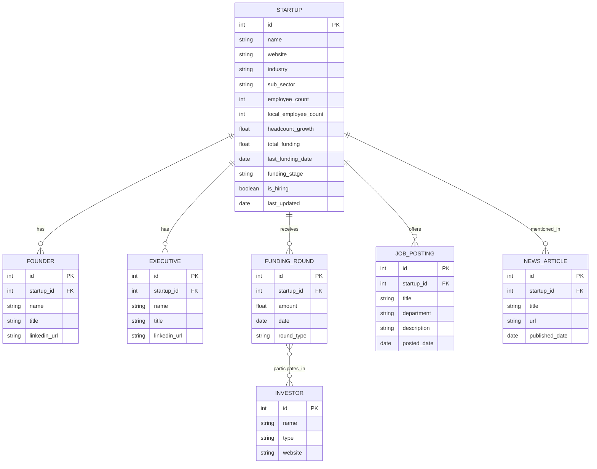

This data model captures the essential entities and relationships required for the Boston Startup Tracker. It allows for efficient querying and data retrieval while maintaining data integrity through proper relationships and constraints.

## DATA STORAGE

The Boston Startup Tracker will utilize a cloud-based storage solution to ensure scalability, reliability, and performance. The following specifications will be implemented:

1. Database Management System:
   - PostgreSQL will be used as the primary RDBMS due to its robustness, scalability, and support for complex queries.

2. Data Retention:
   - All startup data will be retained indefinitely to allow for historical analysis and trend identification.
   - Job postings and news articles will be archived after 12 months to manage storage costs while maintaining historical context.

3. Redundancy:
   - The database will be configured with multi-region replication to ensure high availability and disaster recovery capabilities.
   - Read replicas will be implemented to distribute query load and improve performance.

4. Backup:
   - Full database backups will be performed daily and stored in a separate cloud storage bucket.
   - Incremental backups will be taken every 6 hours to minimize data loss in case of failure.
   - Backups will be retained for 30 days, with monthly archives kept for one year.

5. Recovery:
   - A documented disaster recovery plan will be in place, detailing steps for data restoration.
   - Regular recovery drills will be conducted to ensure the effectiveness of the backup and recovery processes.
   - The system will aim for a Recovery Time Objective (RTO) of 4 hours and a Recovery Point Objective (RPO) of 6 hours.

6. Scalability:
   - The database will be hosted on cloud infrastructure that allows for easy vertical and horizontal scaling.
   - Partitioning and sharding strategies will be implemented to manage large datasets efficiently.

## DATA PROCESSING

The Boston Startup Tracker will implement robust data processing mechanisms to ensure data accuracy, timeliness, and security. The following specifications will be adhered to:

1. Data Collection:
   - Web crawlers will be developed using Python and the Scrapy framework to collect data from public sources.
   - API integrations will be implemented for data sources that provide structured access.

2. Data Validation and Cleaning:
   - Automated data validation processes will be implemented to ensure data integrity and consistency.
   - Machine learning algorithms will be used to detect anomalies and potential data quality issues.

3. Data Enrichment:
   - Third-party APIs will be utilized to enrich startup data with additional information such as social media presence and technology stack.

4. Data Security:
   - All data will be encrypted at rest using AES-256 encryption.
   - Data in transit will be protected using TLS 1.3 encryption.
   - Access to the database will be restricted to authorized personnel only, using role-based access control (RBAC).
   - Regular security audits and penetration testing will be conducted to identify and address vulnerabilities.

5. Data Flow:
   The following diagram illustrates the high-level data flow within the Boston Startup Tracker system:

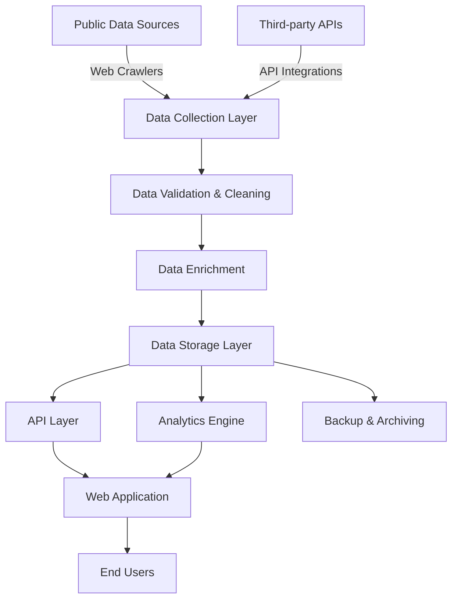

6. Real-time Processing:
   - Apache Kafka will be used for real-time data streaming and processing of updates from various sources.
   - Elasticsearch will be implemented for fast, full-text search capabilities across the startup dataset.

7. Batch Processing:
   - Apache Airflow will be utilized to manage and schedule batch processing jobs for data updates and analytics.

8. Data Governance:
   - A data governance framework will be established to ensure data quality, privacy, and compliance with regulations such as GDPR and CCPA.
   - Data lineage tracking will be implemented to maintain transparency in data sourcing and transformations.

By adhering to these data requirements, the Boston Startup Tracker will ensure a robust, secure, and scalable data infrastructure that supports the platform's functionality and future growth.

# EXTERNAL INTERFACES

## USER INTERFACES

The Boston Startup Tracker will feature a responsive web-based user interface accessible through modern web browsers on desktop and mobile devices. The interface will be designed with a focus on usability, accessibility, and intuitive navigation.

Key components of the user interface include:

1. Dashboard
   - Overview of key startup ecosystem metrics
   - Customizable widgets for personalized data views

2. Search and Filter Interface
   - Advanced search functionality with multiple filter options
   - Auto-suggest feature for company names and industries

3. Startup Profile Pages
   - Comprehensive display of startup information
   - Interactive data visualizations

4. User Account Management
   - Registration and login forms
   - Profile settings and preferences

5. Analytics and Reporting Interface
   - Interactive charts and graphs
   - Custom report generation tools

Mockups for these key interfaces will be developed during the design phase and will adhere to modern UI/UX principles and the project's brand guidelines.

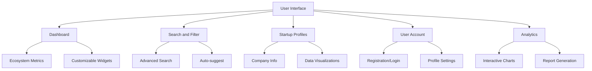

## SOFTWARE INTERFACES

The Boston Startup Tracker will interact with various software systems and components to provide its functionality. These interfaces include:

1. Database Management System
   - PostgreSQL for primary data storage
   - Interface: SQL queries via ORM (e.g., SQLAlchemy)
   - Purpose: Store and retrieve startup data, user information, and system logs

2. Elasticsearch
   - Interface: Elasticsearch API
   - Purpose: Provide fast, full-text search capabilities across the startup dataset

3. Apache Kafka
   - Interface: Kafka Producer and Consumer APIs
   - Purpose: Handle real-time data streaming for updates from various sources

4. Redis
   - Interface: Redis API
   - Purpose: Caching frequently accessed data to improve performance

5. External APIs
   - Interface: RESTful HTTP/HTTPS
   - Purpose: Enrich startup data with additional information (e.g., social media presence, technology stack)

6. Cloud Storage (e.g., Amazon S3)
   - Interface: S3 API
   - Purpose: Store and retrieve large files such as startup logos and documents

7. Authentication Service (e.g., Auth0)
   - Interface: OAuth 2.0 protocol
   - Purpose: Handle user authentication and authorization

8. Email Service (e.g., SendGrid)
   - Interface: SMTP or API
   - Purpose: Send notifications and alerts to users

9. Analytics Service (e.g., Google Analytics)
   - Interface: JavaScript tracking code and API
   - Purpose: Track user behavior and generate usage reports

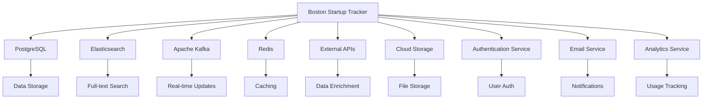

## COMMUNICATION INTERFACES

The Boston Startup Tracker will utilize various communication interfaces to interact with external systems and users:

1. HTTP/HTTPS
   - Protocol: HTTP/1.1, HTTP/2
   - Purpose: Primary communication protocol for web application and API access
   - Security: TLS 1.3 for all communications

2. WebSocket
   - Protocol: WebSocket over TLS
   - Purpose: Real-time updates for dashboard and notifications

3. SMTP
   - Protocol: SMTP with TLS
   - Purpose: Sending email notifications and alerts to users

4. API Communication
   - Protocol: RESTful API over HTTPS
   - Data Format: JSON
   - Authentication: JWT (JSON Web Tokens)
   - Rate Limiting: Implemented to prevent abuse

5. Database Communication
   - Protocol: PostgreSQL wire protocol
   - Security: SSL/TLS encryption for all database connections

6. Kafka Communication
   - Protocol: Kafka protocol (TCP)
   - Security: SASL/SCRAM authentication and TLS encryption

7. Elasticsearch Communication
   - Protocol: HTTP/HTTPS
   - Data Format: JSON
   - Authentication: API key or token-based

8. Redis Communication
   - Protocol: Redis Serialization Protocol (RESP)
   - Security: TLS encryption and password authentication

9. Cloud Storage Communication
   - Protocol: HTTPS
   - Authentication: IAM roles and access keys

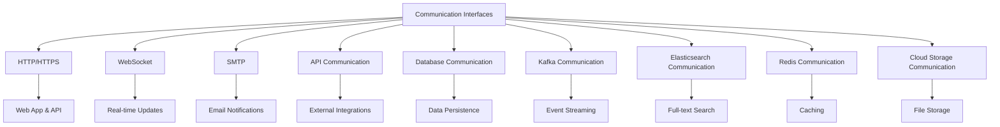

All communication interfaces will be designed with security in mind, implementing encryption, authentication, and authorization mechanisms as appropriate. Regular security audits will be conducted to ensure the integrity and confidentiality of all data transmissions.

# APPENDICES

## GLOSSARY

- **API (Application Programming Interface)**: A set of protocols, routines, and tools for building software applications that specify how software components should interact.

- **Crawler**: An automated program that systematically browses the internet to collect specific information.

- **Data Aggregation**: The process of gathering information from multiple sources into a single, comprehensive dataset.

- **Elasticsearch**: A distributed, open-source search and analytics engine designed for horizontal scalability, reliability, and real-time search.

- **Institutional Funding**: Financial backing provided by large organizations such as venture capital firms, private equity firms, or other financial institutions.

- **PostgreSQL**: An open-source relational database management system emphasizing extensibility and SQL compliance.

- **Redis**: An open-source, in-memory data structure store used as a database, cache, and message broker.

- **RESTful API**: An API that adheres to the principles of Representational State Transfer (REST) architecture.

- **Scalability**: The capability of a system to handle a growing amount of work or its potential to be enlarged to accommodate that growth.

- **Startup Ecosystem**: The network of organizations, resources, and individuals that contribute to the creation and growth of new businesses in a specific geographic area.

- **Venture-backed**: Referring to companies that have received funding from venture capital firms or investors.

## ACRONYMS

- **CCPA**: California Consumer Privacy Act
- **GDPR**: General Data Protection Regulation
- **HTTP**: Hypertext Transfer Protocol
- **HTTPS**: Hypertext Transfer Protocol Secure
- **IAM**: Identity and Access Management
- **JSON**: JavaScript Object Notation
- **JWT**: JSON Web Token
- **MAU**: Monthly Active Users
- **ORM**: Object-Relational Mapping
- **RBAC**: Role-Based Access Control
- **RESP**: Redis Serialization Protocol
- **RTO**: Recovery Time Objective
- **RPO**: Recovery Point Objective
- **SASL**: Simple Authentication and Security Layer
- **SCRAM**: Salted Challenge Response Authentication Mechanism
- **SDK**: Software Development Kit
- **SMTP**: Simple Mail Transfer Protocol
- **SQL**: Structured Query Language
- **SSL**: Secure Sockets Layer
- **SUS**: System Usability Scale
- **TCP**: Transmission Control Protocol
- **TLS**: Transport Layer Security
- **UI**: User Interface
- **UX**: User Experience
- **WCAG**: Web Content Accessibility Guidelines

## ADDITIONAL REFERENCES

1. PostgreSQL Documentation: https://www.postgresql.org/docs/

2. Elasticsearch Guide: https://www.elastic.co/guide/en/elasticsearch/reference/current/index.html

3. Redis Documentation: https://redis.io/documentation

4. Apache Kafka Documentation: https://kafka.apache.org/documentation/

5. GDPR Official Text: https://gdpr-info.eu/

6. CCPA Official Resource: https://oag.ca.gov/privacy/ccpa

7. Web Content Accessibility Guidelines (WCAG) 2.1: https://www.w3.org/TR/WCAG21/

8. RESTful API Design Best Practices: https://restfulapi.net/

9. OWASP Top Ten Web Application Security Risks: https://owasp.org/www-project-top-ten/

10. Boston Startup Ecosystem Report (Startup Genome): https://startupgenome.com/reports

These additional references provide in-depth information on the technologies, frameworks, and regulations mentioned throughout the Software Requirements Specification document. They serve as valuable resources for the development team, stakeholders, and anyone seeking to gain a deeper understanding of the technical and regulatory aspects of the Boston Startup Tracker project.