# INTRODUCTION

## SYSTEM OVERVIEW

The Boston Startup Tracker is a comprehensive web-based platform designed to aggregate, analyze, and present data on venture-backed companies headquartered in Boston. This system serves as a centralized resource for investors, job seekers, researchers, and industry analysts interested in the Boston startup ecosystem.

### Key Components

1. Data Aggregation Engine
   - Web crawlers (Python/Scrapy)
   - API integrations
   - Data validation and cleaning processes

2. Database Management System
   - PostgreSQL for primary data storage
   - Elasticsearch for full-text search capabilities

3. Backend Application
   - RESTful API (Python/Flask or FastAPI)
   - Authentication and authorization system
   - Data processing and analytics engine

4. Frontend Application
   - Responsive web interface (React.js)
   - Interactive data visualizations (D3.js)

5. Real-time Processing
   - Apache Kafka for event streaming

6. Caching Layer
   - Redis for performance optimization

7. Cloud Infrastructure
   - Scalable cloud hosting (e.g., AWS, Google Cloud)
   - Load balancing and auto-scaling

8. External Integrations
   - Third-party APIs for data enrichment
   - Email service (e.g., SendGrid)
   - Analytics service (e.g., Google Analytics)

### System Architecture

The following diagram illustrates the high-level architecture of the Boston Startup Tracker:

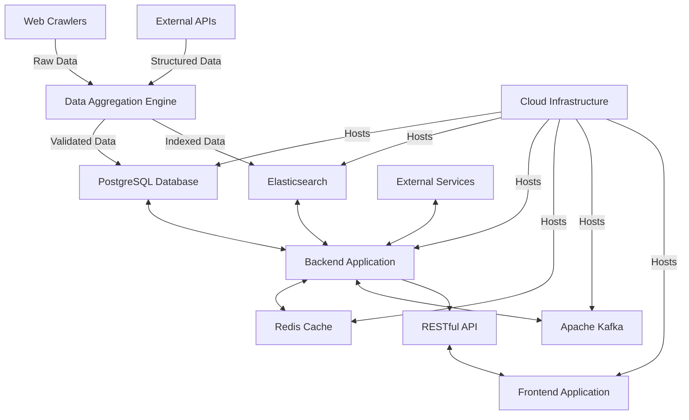

### Key Features

1. Comprehensive startup database with detailed profiles
2. Advanced search and filtering capabilities
3. Real-time data updates and notifications
4. Interactive data visualizations and analytics
5. User account management with personalized features
6. API access for third-party integrations
7. Administrative dashboard for system management

### Target Users

- Investors and venture capitalists
- Job seekers and recruiters
- Entrepreneurs and startup founders
- Researchers and analysts
- Industry professionals and media

The Boston Startup Tracker aims to provide a user-friendly, data-rich platform that offers valuable insights into the Boston startup ecosystem. By leveraging modern web technologies and robust data processing capabilities, the system will deliver timely, accurate information to support decision-making and foster growth within the startup community.

# SYSTEM ARCHITECTURE

## PROGRAMMING LANGUAGES

The Boston Startup Tracker will utilize the following programming languages, chosen for their suitability to the project requirements, ecosystem support, and team expertise:

| Language | Purpose | Justification |
|----------|---------|---------------|
| Python | Backend development, data processing, web crawling | Versatile, extensive libraries for data processing and web development, strong community support |
| JavaScript (ES6+) | Frontend development, interactive visualizations | Industry standard for web development, rich ecosystem of libraries and frameworks |
| SQL | Database queries and management | Essential for working with PostgreSQL, powerful for complex data operations |
| HTML5/CSS3 | Frontend structure and styling | Standard languages for web content and presentation |
| Bash | DevOps scripting, automation | Efficient for system administration tasks and deployment scripts |

## HIGH-LEVEL ARCHITECTURE DIAGRAM

The following diagram provides an overview of the Boston Startup Tracker's system architecture:

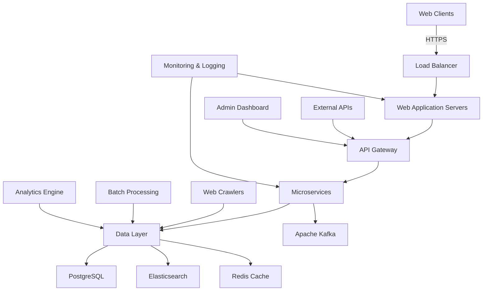

## COMPONENT DIAGRAMS

### Backend Components

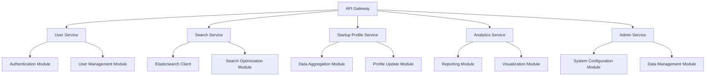

### Frontend Components

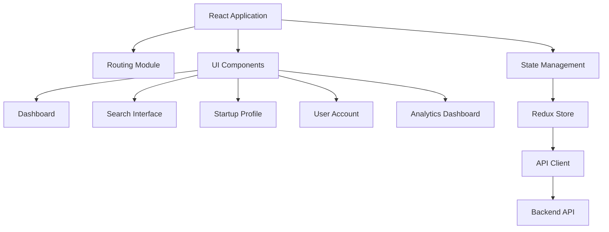

## SEQUENCE DIAGRAMS

### User Search Sequence

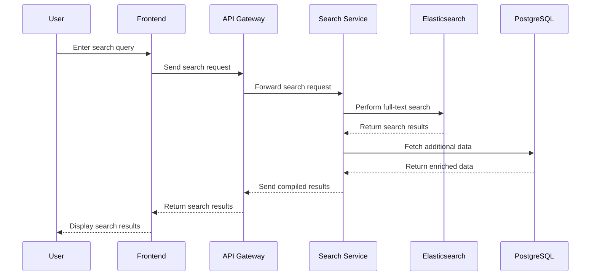

### Data Update Sequence

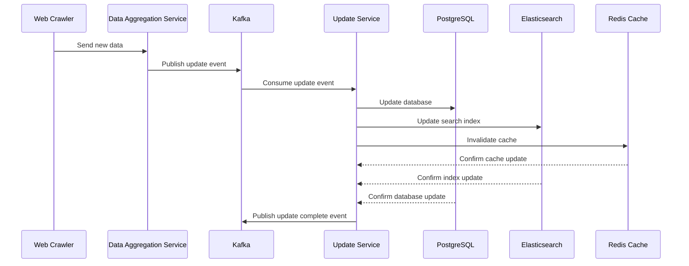

## DATA-FLOW DIAGRAM

The following diagram illustrates how data flows through the Boston Startup Tracker system:

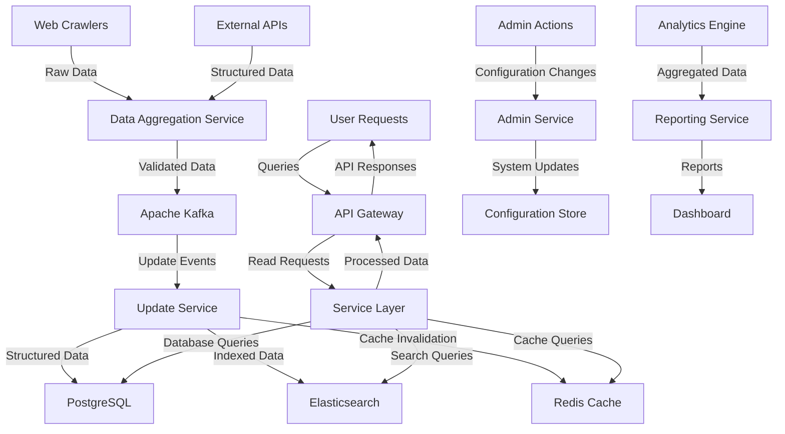

This data flow diagram demonstrates how information moves through the system, from data collection and processing to user interactions and administrative functions. It highlights the central role of the data storage and caching layers in supporting the various services and ensuring efficient data retrieval and updates.

# SYSTEM DESIGN

## PROGRAMMING LANGUAGES

The Boston Startup Tracker will utilize the following programming languages, chosen for their suitability to the project requirements, ecosystem support, and team expertise:

| Language | Purpose | Justification |
|----------|---------|---------------|
| Python | Backend development, data processing, web crawling | Versatile, extensive libraries for data processing and web development, strong community support |
| JavaScript (ES6+) | Frontend development, interactive visualizations | Industry standard for web development, rich ecosystem of libraries and frameworks |
| SQL | Database queries and management | Essential for working with PostgreSQL, powerful for complex data operations |
| HTML5/CSS3 | Frontend structure and styling | Standard languages for web content and presentation |
| Bash | DevOps scripting, automation | Efficient for system administration tasks and deployment scripts |

## DATABASE DESIGN

The Boston Startup Tracker will use PostgreSQL as its primary relational database management system. The database design will focus on efficiency, scalability, and data integrity.

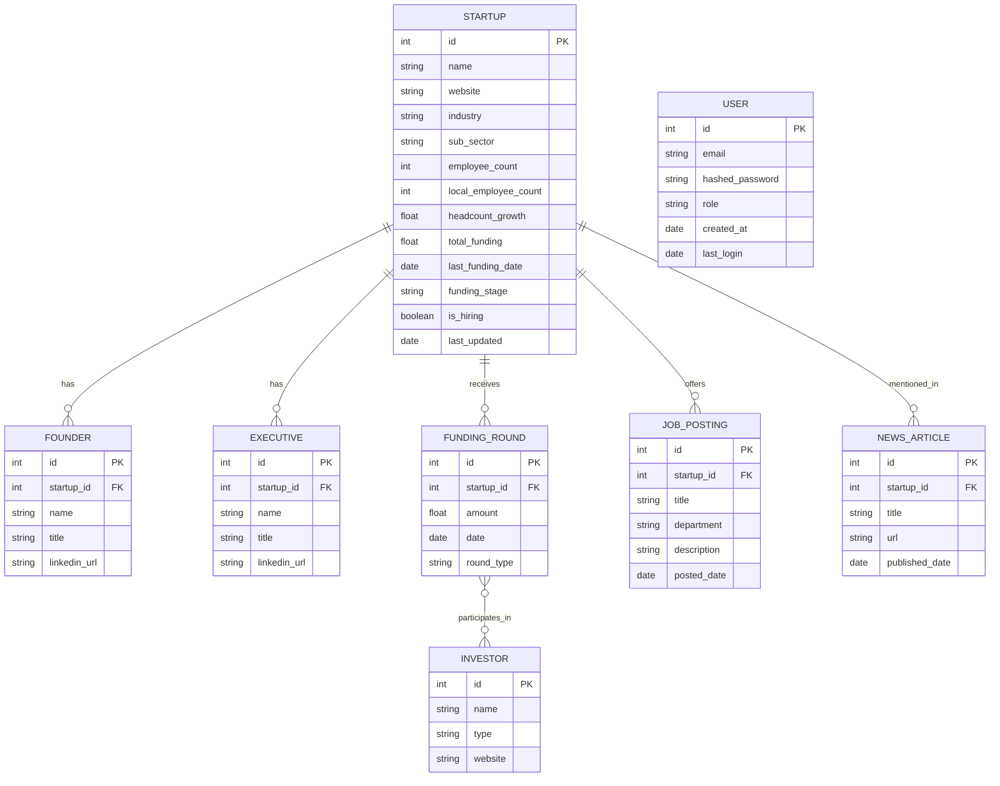

This design ensures proper relationships between entities and allows for efficient querying of startup data. Indexes will be created on frequently queried columns to optimize performance.

## API DESIGN

The Boston Startup Tracker will implement a RESTful API using Python Flask or FastAPI. The API will follow best practices for versioning, authentication, and rate limiting.

Key API endpoints:

| Endpoint | Method | Description |
|----------|--------|-------------|
| `/api/v1/startups` | GET | List startups with pagination and filtering |
| `/api/v1/startups/{id}` | GET | Retrieve detailed information for a specific startup |
| `/api/v1/search` | GET | Search startups based on various criteria |
| `/api/v1/investors` | GET | List investors with pagination |
| `/api/v1/funding-rounds` | GET | List funding rounds with pagination and filtering |
| `/api/v1/jobs` | GET | List job postings with pagination and filtering |
| `/api/v1/news` | GET | List news articles with pagination and filtering |
| `/api/v1/analytics` | GET | Retrieve aggregated analytics data |

Authentication will be implemented using JWT (JSON Web Tokens), and rate limiting will be enforced to prevent abuse.

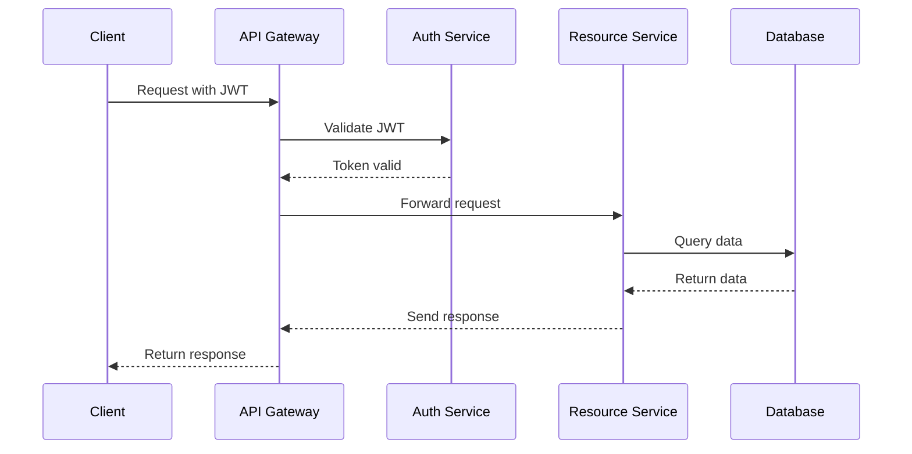

## USER INTERFACE DESIGN

The Boston Startup Tracker will feature a responsive web interface built using React.js. The design will focus on usability, accessibility, and intuitive navigation.

Key components of the user interface:

1. Dashboard
   - Overview of key startup ecosystem metrics
   - Customizable widgets for personalized data views

2. Search and Filter Interface
   - Advanced search functionality with multiple filter options
   - Auto-suggest feature for company names and industries

3. Startup Profile Pages
   - Comprehensive display of startup information
   - Interactive data visualizations using D3.js

4. User Account Management
   - Registration and login forms
   - Profile settings and preferences

5. Analytics and Reporting Interface
   - Interactive charts and graphs
   - Custom report generation tools

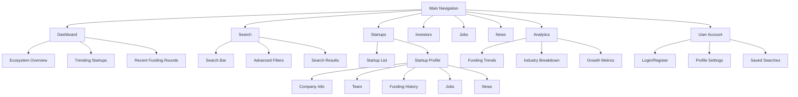

The user interface will be designed to be responsive, ensuring a consistent experience across desktop and mobile devices. Accessibility features will be implemented to comply with WCAG 2.1 Level AA standards.

This system design aligns with the previously established technical requirements and architecture, ensuring a cohesive and efficient implementation of the Boston Startup Tracker.

# TECHNOLOGY STACK

## PROGRAMMING LANGUAGES

The Boston Startup Tracker will utilize the following programming languages:

| Language | Purpose | Justification |
|----------|---------|---------------|
| Python | Backend development, data processing, web crawling | Versatile, extensive libraries for data processing and web development, strong community support |
| JavaScript (ES6+) | Frontend development, interactive visualizations | Industry standard for web development, rich ecosystem of libraries and frameworks |
| SQL | Database queries and management | Essential for working with PostgreSQL, powerful for complex data operations |
| HTML5/CSS3 | Frontend structure and styling | Standard languages for web content and presentation |
| Bash | DevOps scripting, automation | Efficient for system administration tasks and deployment scripts |

## FRAMEWORKS AND LIBRARIES

The following frameworks and libraries will be utilized in the development of the Boston Startup Tracker:

| Category | Technology | Purpose |
|----------|------------|---------|
| Backend Framework | Flask | Lightweight and flexible Python web framework for building the API |
| ORM | SQLAlchemy | Python SQL toolkit and ORM for database interactions |
| Task Queue | Celery | Distributed task queue for handling background jobs and scheduled tasks |
| Frontend Framework | React | JavaScript library for building user interfaces |
| State Management | Redux | Predictable state container for managing application state |
| UI Components | Material-UI | React component library implementing Google's Material Design |
| Data Visualization | D3.js | JavaScript library for creating dynamic, interactive data visualizations |
| Web Crawling | Scrapy | Python framework for extracting data from websites |
| API Documentation | Swagger/OpenAPI | Tool for designing, building, and documenting RESTful APIs |
| Testing | pytest, Jest | Testing frameworks for Python and JavaScript respectively |
| Containerization | Docker | Platform for developing, shipping, and running applications in containers |

## DATABASES

The Boston Startup Tracker will employ the following database systems:

| Database | Type | Purpose |
|----------|------|---------|
| PostgreSQL | Relational | Primary data storage for structured startup and user data |
| Elasticsearch | Document-based | Full-text search engine for efficient querying of startup information |
| Redis | Key-value store | Caching layer for improved performance and session management |

## THIRD-PARTY SERVICES

The following external services and APIs will be integrated into the Boston Startup Tracker:

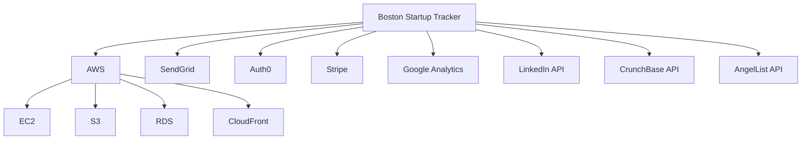

| Service | Purpose |
|---------|---------|
| AWS (Amazon Web Services) | Cloud infrastructure for hosting and scaling the application |
| SendGrid | Email delivery service for notifications and alerts |
| Auth0 | Authentication and authorization service |
| Stripe | Payment processing for premium subscriptions |
| Google Analytics | Web analytics for tracking user behavior and generating insights |
| LinkedIn API | Enriching startup and founder data |
| CrunchBase API | Supplementary startup and funding information |
| AngelList API | Additional startup ecosystem data |

This technology stack has been chosen to ensure consistency with the previously established technical requirements and system architecture. It provides a robust, scalable, and maintainable foundation for the Boston Startup Tracker, leveraging industry-standard tools and services to deliver a high-quality product.

# SECURITY CONSIDERATIONS

## AUTHENTICATION AND AUTHORIZATION

The Boston Startup Tracker will implement a robust authentication and authorization system to ensure secure access to the platform and its resources.

### Authentication

1. User Authentication:
   - Multi-factor authentication (MFA) will be implemented using Auth0.
   - Users can authenticate using email/password or social login options (Google, LinkedIn).
   - Passwords must meet the following complexity requirements:
     - Minimum 12 characters
     - At least one uppercase letter, one lowercase letter, one number, and one special character
   - Failed login attempts will be limited to 5 within a 15-minute window, after which the account will be temporarily locked.

2. API Authentication:
   - JWT (JSON Web Tokens) will be used for API authentication.
   - Tokens will have a short expiration time (1 hour) and will be refreshed using refresh tokens.
   - API keys will be provided for third-party integrations with appropriate rate limiting.

### Authorization

Role-Based Access Control (RBAC) will be implemented to manage user permissions:

| Role | Permissions |
|------|-------------|
| Anonymous | View public startup information, search startups |
| Registered User | All Anonymous permissions, save searches, receive notifications |
| Premium User | All Registered User permissions, access advanced analytics, export data |
| Admin | All Premium User permissions, manage users, edit startup data, access system logs |

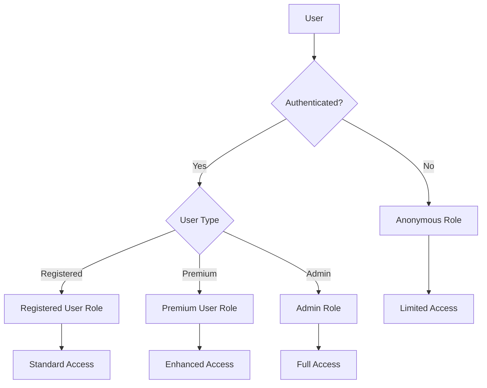

## DATA SECURITY

To protect sensitive information and maintain user trust, the Boston Startup Tracker will implement the following data security measures:

1. Encryption:
   - All data at rest will be encrypted using AES-256 encryption.
   - Data in transit will be protected using TLS 1.3 encryption.

2. Data Anonymization:
   - Personal user data will be anonymized or pseudonymized where possible.
   - Aggregated analytics data will not contain personally identifiable information (PII).

3. Data Access:
   - Access to the production database will be restricted to authorized personnel only.
   - Database access logs will be maintained and regularly audited.

4. Data Backup and Recovery:
   - Daily backups of all data will be performed and stored in a secure, off-site location.
   - Backup data will be encrypted using the same standards as production data.
   - Regular recovery drills will be conducted to ensure data can be restored within the specified RTO and RPO.

5. Third-party Data Handling:
   - All third-party services used by the platform will be vetted for compliance with data protection regulations.
   - Data sharing agreements will be in place with any third-party services that handle user data.

6. Data Retention and Deletion:
   - User data will be retained only as long as necessary for the purposes it was collected.
   - Users will have the ability to request deletion of their personal data in compliance with GDPR and CCPA.

## SECURITY PROTOCOLS

The following security protocols will be implemented to maintain the overall security of the Boston Startup Tracker system:

1. Secure Development Lifecycle:
   - Security requirements will be integrated into the development process from the beginning.
   - Regular code reviews and static code analysis will be performed to identify potential vulnerabilities.
   - Dependency scanning will be implemented to detect and mitigate vulnerabilities in third-party libraries.

2. Network Security:
   - Firewalls will be configured to restrict inbound and outbound traffic to only necessary ports and protocols.
   - Intrusion Detection and Prevention Systems (IDS/IPS) will be implemented to monitor and protect against network attacks.
   - Virtual Private Networks (VPNs) will be used for remote access to production systems.

3. Monitoring and Logging:
   - Centralized logging will be implemented using the ELK stack (Elasticsearch, Logstash, Kibana).
   - Security Information and Event Management (SIEM) system will be used to correlate and analyze security events.
   - Automated alerts will be set up for suspicious activities or potential security breaches.

4. Incident Response:
   - A detailed incident response plan will be developed and regularly updated.
   - Regular security drills will be conducted to test the effectiveness of the incident response plan.
   - A dedicated security team will be available 24/7 to respond to potential security incidents.

5. Compliance and Auditing:
   - Regular security audits will be conducted by internal and external teams.
   - Penetration testing will be performed at least annually by a qualified third-party security firm.
   - Compliance with relevant standards (e.g., SOC 2, ISO 27001) will be maintained and regularly assessed.

6. Security Awareness:
   - All employees will undergo regular security awareness training.
   - Phishing simulations will be conducted to test and improve employee awareness.

7. API Security:
   - API endpoints will be protected against common attacks such as injection, XSS, and CSRF.
   - Rate limiting and throttling will be implemented to prevent API abuse.

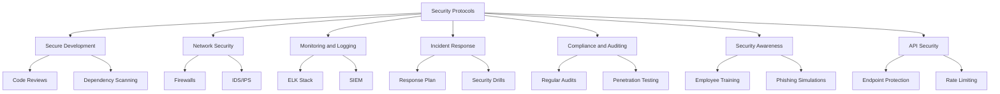

By implementing these comprehensive security measures, the Boston Startup Tracker aims to protect user data, maintain system integrity, and ensure compliance with relevant regulations and industry standards.